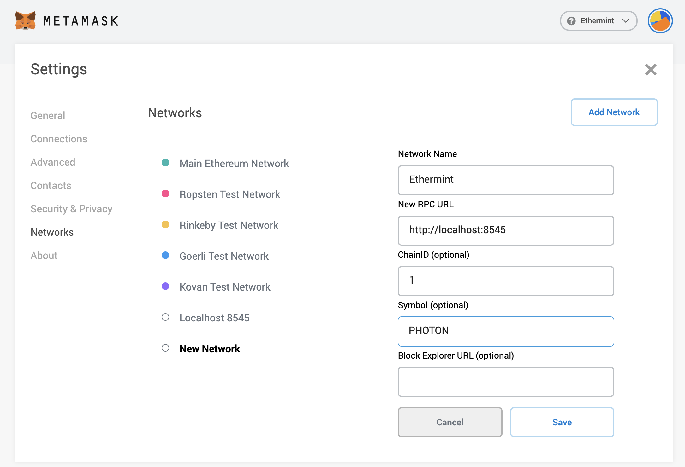
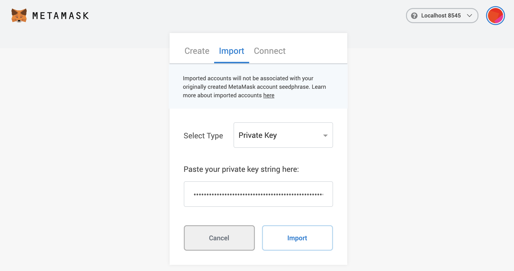

<!--
order: 1
-->

# Metamask

Connect your Metamask wallet with Ethermint on a localnet mode. {synopsis}

## Start node and REST server

Start the Ethermint node using your terminal:

```bash
emintd start --pruning=nothing --rpc.unsafe --log_level "main:info,state:info,mempool:info"
```

::: tip
You can also start a node from scratch by running `./init.sh` from the Ethermint repository directory. This will generate a key called `mykey` that you can use on the next step.
:::

In another tab start the REST server. Here replace `mykey` with the name of the key that you want to use and set the `chain-id` the chain identifier of your application.

```bash
emintcli rest-server --laddr "tcp://localhost:8545" --unlock-key mykey --chain-id 1
```

## Adding a custom Network for Ethermint

One og the main limitations of using the default `Localhost 8545` network is that the tokens will be represented as `ETH`.

Open the Metamask extension on your browser, you may have to log in to your Metamask account if you
are not already. Then click the top right circle and go to `Settings` > `Networks`. Press the `Add
Network` button and fill the form as shown below with your application `ChainID`.



## Import Account to Metamask

Then close the settings, and go to `My Accounts` (top right circle) and select `Import Account`. You should see and image like the following one:



Now you can export your private key from the terminal using the following command. Again, make sure
to replace `mykey` with the name of the key that you want to export:

```bash
emintcli keys unsafe-export-eth-key mykey
```

Go back to the browser and select the `Private Key` option. Then paste the private key exported from
the `unsafe-export-eth-key` command.

Your account balance should show up as `1 PHOTON` and do transfers as usual.

::: tip
If it takes some time to load the balance of the account, change the network to `Main Ethereum
Network` (or any other than `Localhost 8545` or `Ethermint`) and then switch back to `Ethermint`.
:::

## Downloading State

to see metamask logs, go to top right circle -> settings -> advanced -> download state logs. if you search through the json file for the account address you'll find the tx history

## Known issues

Currently, it's not possible to add custom tokens (even for Photons) unless you deploy a token contract (eg: ERC20).
