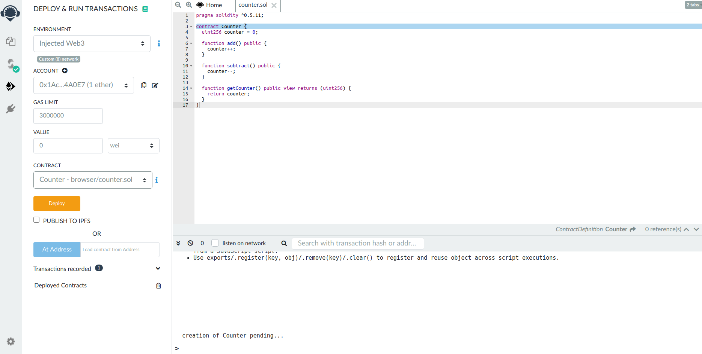

<!--
order: 1
-->

# Remix

Set up a Remix Ethermint local development environment. {synopsis}

## Pre-requisite Readings

- [Installation](./../quickstart/installation.md) {prereq}
- [Run a node](./../quickstart/run_node.md) {prereq}
- [Metamask](./metamask.md) {prereq}

[Remix](http://remix.ethereum.org/) is an in-browser IDE for [Solidity](https://github.com/ethereum/solidity) smart contracts. In this guide, we will learn how to deploy a contract to a running Ethermint network through Remix and interact with it.

### Connect ethermint account to Remix

First, follow the steps in the [Metamask guide](./metamask.md) to import your Ethermint private key into Metamask. Start the Ethermint daemon and rest server.

Once that is complete, go to [Remix](http://remix.ethereum.org/). There are some contracts in the File Explorer. Select any of these contracts.  On the left-most bar, select the Solidity Compiler and compile the contract.

Next, select the `Deploy and Run` option. Select `injected web3` as the environment. This will open a metamask popup for you to confirm connecting your Metamask to Remix. Hit confirm. 

You should see your account show up in the left-hand panel.



### Deploy and interact

Now that your account is connected, you are able to deploy the contract. Press the `Deploy` button. You should see a log for the deployment transaction in the ethermint daemon logs:

```bash
I[2020-07-15|17:26:43.155] Added good transaction                       module=mempool tx=877A8E6600FA27EC2B2362719274314977B243671DC4E5F8796ED97FFC0CBE42 res="&{CheckTx:log:\"[]\" gas_wanted:121193 }" height=31 total=1
```

